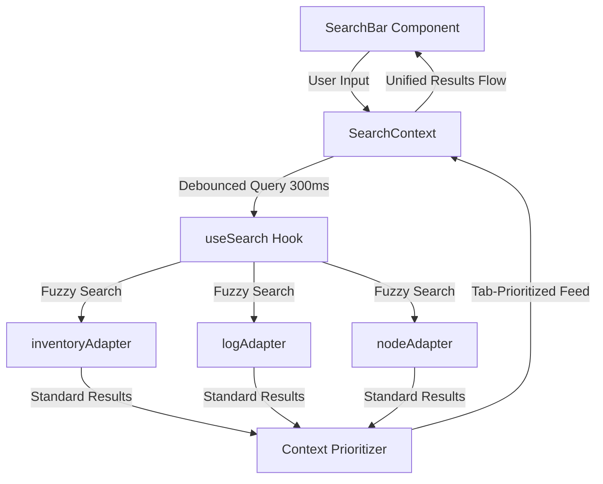

# Global Context-Aware Search System

An industrial-grade, high-performance global search subsystem enabling real-time, debounced fuzzy searches across SCADA telemetry, inventory logs, and geographic pipeline nodes.

## Architectural Overview

The global search system is designed for rapid operator triage. It normalizes search inputs, executes fuzzy queries in parallel, and prioritizes results dynamically based on the operator's active view tab.

## Core Modules

### 1. [SearchBar.tsx](file:///usr/local/google/home/prasannaankem/Code/Field%20Operations/src/components/Search/SearchBar.tsx)
* Renders a high-fidelity, glassmorphism search box featuring dynamic asset-specific icons (Package, Terminal, GitBranch) and inline loading feedback.
* Automatically closes dropdown results on outside-click.
* Instantly triggers the context-aware action dispatcher on selection.

### 2. [SearchContext.tsx](file:///usr/local/google/home/prasannaankem/Code/Field%20Operations/src/components/Search/SearchContext.tsx)
* Stores global query inputs, parallel search outputs, and map highlighting state variables.
* Implements an action handler reducer translating search results into map highlights (`HIGHLIGHT_MAP`) or sliding context drawers (`OPEN_DRAWER`).

### 3. [useSearch.ts](file:///usr/local/google/home/prasannaankem/Code/Field%20Operations/src/components/Search/useSearch.ts)
* A custom React hook providing a `300ms` debounced search orchestrator.
* **Context Prioritization:** Matches that align with the user's active tab are bubble-sorted to the top of the results feed (e.g. highlighting pipeline nodes first if the operator is looking at the topology map).

### 4. [Adapters Subdirectory](file:///usr/local/google/home/prasannaankem/Code/Field%20Operations/src/components/Search/adapters/README.md)
* Normalizes source datasets into a single, unified interface. See the [Adapters Sub-README](file:///usr/local/google/home/prasannaankem/Code/Field%20Operations/src/components/Search/adapters/README.md) for detail.

## Verification Plan

### Technical Checklist
* [x] Fuzzy thresholds tuned to `0.3` to filter low-confidence matches.
* [x] Stricter type assertions (`typeof action.payload === 'string'`) on context map highlighting actions to safeguard against type safety crashes.
* [x] Debounce handler cleanly clears timeout cycles on component unmount to avoid memory leaks.

### Verification Verification
1. Navigate to the application dashboard.
2. Type in partial queries (e.g. `vibrat` for vibration logs, `valv` for valves, or part numbers).
3. Verify results populate instantly inside the floating dropdown list.
4. Confirm selecting a node navigates you to the topology screen and highlights the respective geographic node coordinates.
